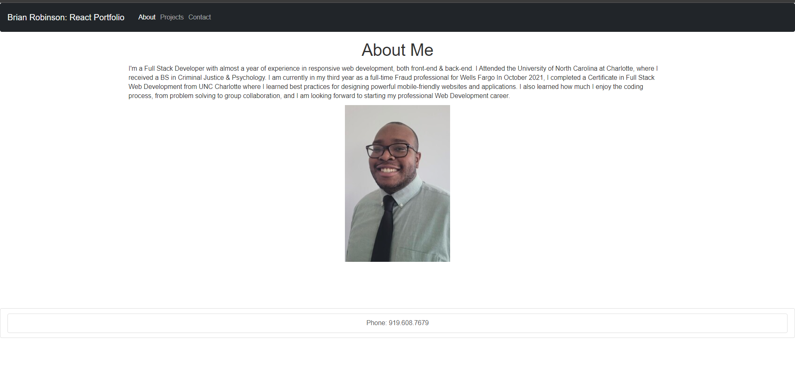
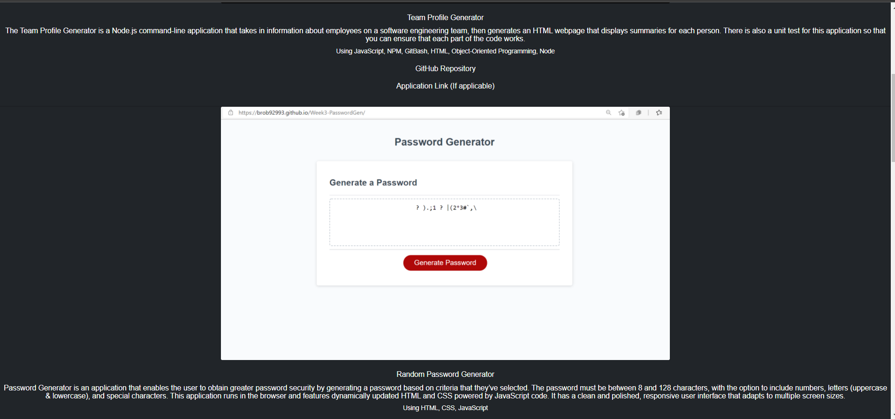

# React Portfolio

## Description
An iteration of my portfolio using the React Application

  ## Table of Contents
  
  * [Installation](#installation)
  
  * [Usage](#usage)
  
  * [License](#license)

  * [Tests](#tests)
  
  * [Questions](#questions)
  
  ## Installation
  
  To install necessary dependencies, run the following command: "npm i".

 
  ## Usage

To start the app in the CLI : "npm start"  

Below you will see a screenshot of what the homepage & the projects page of the application looks like. From the homepage, you have links to the project and contacts page, as well as a contact number located in the footer. In the projects page, you will see a screenshot, details, and links to projects that i have completed.

  

  ## License
    
    This application is licensed under the MIT license.
    

  ## Tests
  
  There are no tests for this application.
  
      
  ## Questions  

  If you have any questions about the repo or application, open an issue or contact me directly at sample. More of my work can be found at [My Github](https://github.com/brob92993).

  [React Portfolio Repository](https://github.com/brob92993/ReactPortfolio.git)

  
  [Deployed application]()